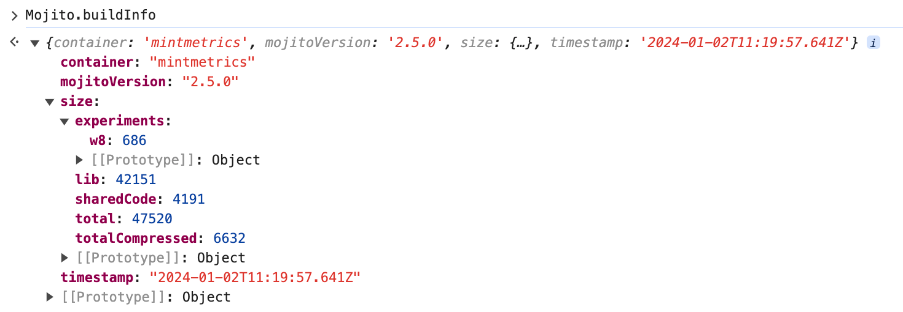

Today we release Mojito JS Delivery v2.5.0, the latest version of our versatile JavaScript split testing library. This release focuses on improving your workflow by significantly reducing dependencies and build times through the new npm Scripts. We also introduce new container visibility enhancements to help you keep your container weight under check.

## Bye to Gulp, Hello to npm Scripts
We've replaced our aging Gulp build scripts with npm Scripts, waving goodbye to the older, aging Gulp ecosystem. This shift to npm scripts reduces dependencies by over 60% and significantly improves build times. Specifically, our Bitbucket Pipelines build times have improved by over 30%.

## New Features & Updates

* **New Build Tools Suite**: We've replaced the old gulp pipeline with a suite of new build tools. These npm script-based tools provide a more modern, efficient, and streamlined build process. Refer to the documentation for how the new syntax should work within your build tools.

* **Improved Container Statistics**: When you build your container, we now show how heavy each component and experiment is inside your container, helping you to streamline your experiments as much as possible. We also save this information and other build info to the container under the Mojito.buildInfo key for easier debugging.



* **Active Development Environment**: With the new `npm run watch` command, your container is deployed to your development environment as you actively work on experiments and files inside the container. To use this command, you'll need to be using Amazon S3 and have `nodemon` installed:

```sh
$ npm install -g nodemon
$ npm run watch

> mojito-js-delivery@2.5.0 watch
> nodemon --on-change-only -e js,css,yml --watch ./lib --exec npm run deploy

[nodemon] 3.0.2
[nodemon] to restart at any time, enter `rs`
[nodemon] watching path(s): lib/**/*
[nodemon] watching extensions: js,css,yml
[nodemon] restarting due to changes...
[nodemon] starting `npm run deploy`

> mojito-js-delivery@2.5.0 deploy
> node scripts/command.js --command deploy

┌────┬────────────────────────────┬───────┬────────────┬────────────────┐
│ ID │ Name                       │ State │ Size (raw) │ % of container │
├────┼────────────────────────────┼───────┼────────────┼────────────────┤
│ w8 │ W8 Mojito.mx headline copy │ live  │ 0.67kb     │           1.4% │
├────┼────────────────────────────┼───────┼────────────┼────────────────┤
│ -  │ Shared code                │ -     │ 4.09kb     │           8.8% │
├────┼────────────────────────────┼───────┼────────────┼────────────────┤
│ -  │ Library code               │ -     │ 41.16kb    │          88.7% │
└────┴────────────────────────────┴───────┴────────────┴────────────────┘

Container size (raw): 46.41kb
Container size (minified & gzipped): 6.48kb
Experiments: 1
Published: ./dist/assets/js/mintmetrics.js
Published: ./dist/assets/js/mintmetrics.pretty.js
[nodemon] clean exit - waiting for changes before restart
```


## Important - Breaking Changes
As we transition from Gulp to npm Scripts, please note that the legacy gulp CLI commands have been replaced by newer npm commands. You'll need to update your CI tooling or Bitbucket Pipelines to use this new version of Mojito JS Delivery.

### New CLI Commands
For detailed instructions on how to use these commands, please refer to our [npm Scripts CLI reference for Mojito JS Delivery](https://mojito.mx/docs/js-delivery-npm-scripts-commands).

## Changelog
For a comprehensive list of changes and updates in v2.5.0, refer to our full [changelog on Github](https://github.com/mintmetrics/mojito-js-delivery/compare/v2.4.1...v2.5.0).

## Final Thoughts
We hope these updates and features will excite you as much as we are about them. As always, feel free to share any issues or comments over on our GitHub. Happy testing and happy new year!

*Note: Mojito v2.5.0 is a significant upgrade. Before updating, we recommend you thoroughly test it in your development environment.*
